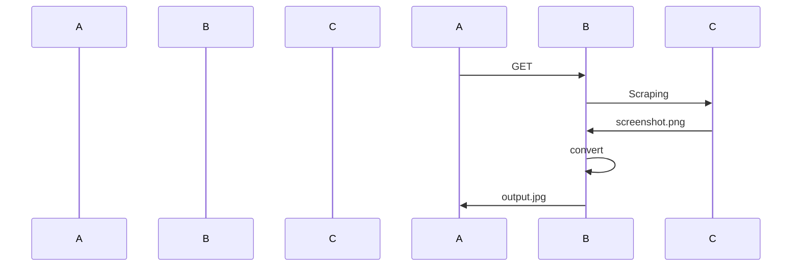

# 構成

```mermaid
sequenceDiagram
  participant m5paper as A
  participant scrapingサーバー as B
  participant webサーバー as C
  A->>B: GET
  B->>C: Scraping
  C->>B: screenshot.png
  B->>B: convert
  B->>A: output.jpg
```
